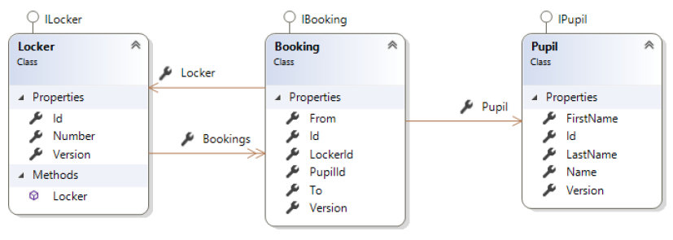
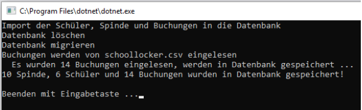
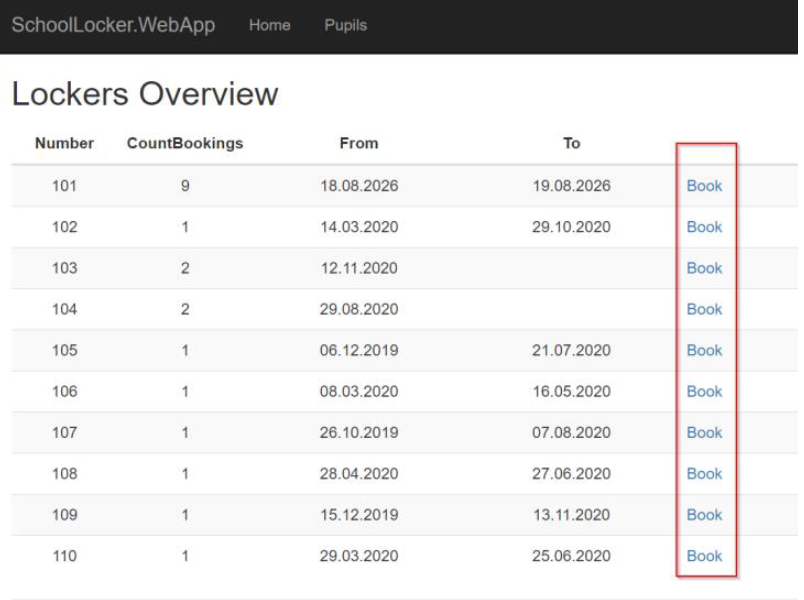
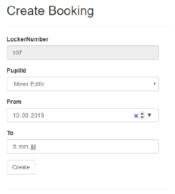
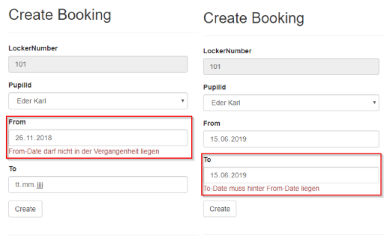
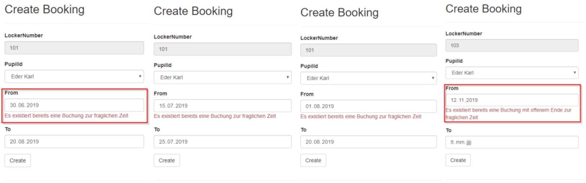
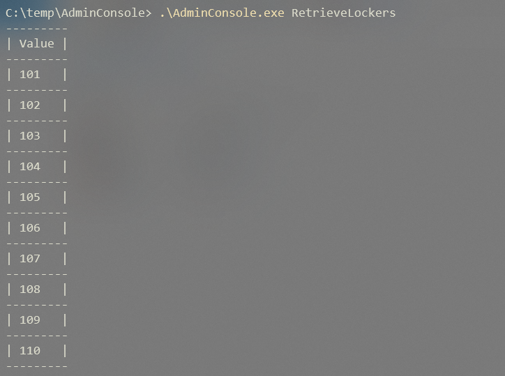
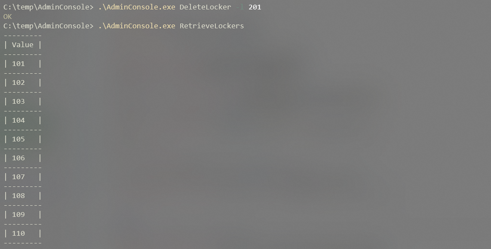

# SchoolLocker (Teil 2)

## Lernziele

* ASP.NET Core Razor Pages
* ASP.NET Core WebApi
* Entity Framework Core
* Muster: UnitOfWork, Repositories
* Validierung

Es ist eine einfache Verwaltung von Buchungen für die Spinde in der Schule zu erstellen. Im Zentrum der Anwendung steht die Buchung (`Booking`) eines Spindes (`Locker`) durch einen Schüler (`Pupil`).

Ein Schüler kann mehrere Spinde anmieten. Ein Spind kann mehrfach, aber natürlich nicht gleichzeitig gebucht werden. Es ist möglich, bei der Buchung das Ende-Datum offen zu lassen.

## Core

Die Entitätsklassen sind bereits angelegt. Auch die Annotationen zur Definition (inkl. der Migrationen) der Datenbank sind bereits implementiert.

## Klassendiagramm

Im Core-Layer sind die Contracts für die Repositories bedarfsgerecht zu erweitern. Die leeren Interfaces sind bereits vorgegeben.

## Import / Persistierung

Es werden die 10 Spinde mit 14 Buchungen für 6 Schüler aus der Datei schoollocker.csv importiert.

Die Migration wurde bereits angelegt und muss nur verwendet werden, wenn an den Entitätsklassen Änderungen vorgenommen werden:

* Persistence als StartupProject
* `Add-Migration InitialMigration`
* `UpdateDatabase` mit Kontrolle, ob DB angelegt wurde
* Die Daten über die `ImportConsole` importieren.

Die `ConnectionStrings` wurden in den relevanten Projekten schon in der appSettings.json festgelegt.

## ASP.NET Core Razor Pages (SchoolLocker.WebApp)

Erweitern Sie das die bestehende `Index.cshtml` (Beispiel [SchoolLocker I](https://github.com/jfuerlinger/csharp_samples_razorpages_schoollocker-part1-template)) um die Möglichkeit zu einem Spind eine Buchung durchzuführen:

Die Buchung soll über eine neue Razor Page `Bookings/Create.cshtml` implementiert werden:

Folgende Randbedingungen sind beim Anlegen einer neuen Buchung zu beachten:

Die Nummer des Spindes wurde in der Übersichtsseite ausgewählt und ist nicht änderbar
* Der Schüler kann über ein `Select`-Element ausgewählt werden
* Das `From`-Datum darf nicht in der Vergangenheit liegen
  * Als Standardwert ist das aktuelle Datum vorzugeben
* Das `To`-Datum muss hinter dem `From`-Datum liegen
* Es darf für den zu buchenden Zeitraum für den gewählten Spind keine weitere Buchung existieren
  * Ist die letzte Buchung für den Spind mit offenem Zieldatum eingetragen, kann dieser Spind nicht gebucht werden.
* Fehlermeldungen sind entsprechend den Vorlagen auszugeben.

Nach erfolgreicher Buchung ist wieder die Übersichtsseite aufzurufen.

### Bildschirmausgaben (Validierungen)

**Hinweis:** Diese oben dargestellten Validierungen können über simple Attribut-Validierungen der Properties des `Booking`-Objekts durchgeführt werden ohne Daten aus der Datenbank laden zu müssen.

Schwieriger ist es Validierunge durchzuführen, welche bereits existierende Daten in der Datenbank berücksichtigen müssen. Z.B. ist für einen spezifischen Zeitpunkt bereits eine andere Buchung zu diesem Spint vorhanden. Dazu muss das Validierungsattribut Zugriff auf eine UnitOfWork besitzen.

Im Template wurden diesbezüglich bereits Vorarbeiten geleistet - suchen sie nach `TODO:` Kommentaren.

## Admin Console (SchoolLocker.AdminConsole)

Zur einfachen Verwaltung von Spinden bzw. deren Buchungen soll zudem eine Konsolenapplikation umgesetzt werden.

Folgende Funktionen sollen zur Verfügung stehen:

1. AddLocker
2. RetrieveLockers
3. DeleteLocker
4. CreateBooking

Die Validierungen, aus der WebSite müssen auch identisch in der AdminConsole funktionieren! Verwenden Sie dazu die bereits für die WebSite-Validierung notwendigen Validierungs-Attribute. Um die Validierung auf Objektebene durchführen zu können, steht die Hilfsmethode `ConsoleValidations.ValidateObject( ... )` zur Verfügung.

Die Parameterübergabe an die Admin Console ist im Template bereits umgesetzt (Hinweis: NuGet-Paket [CommandLineParser](https://www.nuget.org/packages/CommandLineParser/)).

Implementieren Sie die geforderten Funktionen in Anlehnung an folgende Screenshots:

1. Spint erstellen (Nr: 201) und Spints abfragen:

   

1. Versuch den Spint 201 nochmals zu erstellen muss scheitern:

   

1. Buchung erstellen (Von-Datum liegt in der Vergangenheit):

   

1. Buchung erstellen (Von-Datum liegt nach dem Bis-Datum):

   

1. Buchung erstellen:

   

1. Versuch die Buchung mit gleichem Zeitraum nochmals erstellen muss scheitern:

   

1. Spint (Nr: 201) löschen und Spints abfragen:

   

## Hinweise
- Verwenden Sie zum Sicherstellen der Datenkonsistenz (siehe Screenshots der Website) die notwendigen Validierungsattribute.
- Verwenden Sie dort wo sinnvoll DataTransferObjects
- Achten Sie auf eine korrekte Schichtentrennung (Core, Persistence und Web)
- Verwenden Sie das UnitOfWork-Muster
- Dependency Injection (IoC) verwenden
- Erweitern Sie, wo notwendig die Repositories

